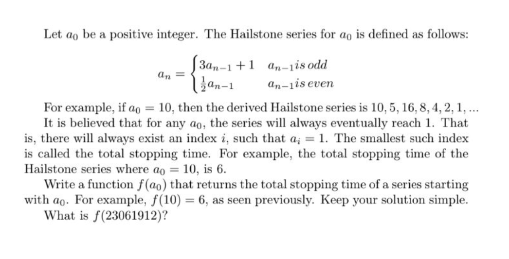

# Backpack.io: ​ Developer Challenge Requirements and Instructions
* There are 4 questions in this test
* Test duration should be 4 hours
* Candidates can reference any resource , online or otherwise. We expect working , correct solutions.
* We expect some quality assurance to be done (e.g. unit tests)

### Test SQL Query
You have table USERS (userID, name) and table USER_TAGS (userID, tag). 
User from table USERS can have no tags associated to him, one tag or multiple. 
Please write SQL query that will return name and comma-separated list 
of associated tags for every user from table USERS.

### String Manipulation
Provided some string of N characters. 
Describe 3 different ways of reversing this string. 
Order the solution by efficiency , naming their Big O analysis. 
Implement one of them. Include unit tests where possible.

### Math Problem

 
### Scheduler Problem
“A schedule or a timetable, as a basic time-management tool, 
consists of a list of times at which possible tasks, events, or actions are intended to take place, 
or of a sequence of events in the chronological order in which such things are intended to take place.”
Implement an in-memory scheduler services that can:
```
(a) register and unregister events collected from external services 
(b) prints the events to screen including “event name, data-time, source”.
```
Input to the scheduler includes:
- Create date as a date time object
- Registered as a boolean
- Event name as a string
- Publish time as date time object

---

# Results

### Task 1
Run all SQLQuery.sql using shell like:
```
mysql -h host -uUser -pPassowrd < SQLQuery.sql
```
as result you should expect:

userId|name|tags
----------- | ------------ | --------------
1|George Washington|president,human,good
2|John Adams|president,alien,a man
3|Thomas Jefferson|strong,president,not a boy
1|1|1

where last line is Test of Sql Query

### Task 2
3 Different options
1. My implementation
I have implemented O(n), where n is length of string
and also developed a test in StringManipulationTest.php

2. Best is to use native php strrev
[strrev](https://github.com/php/php-src/blob/a555cc0b3d4f745e6d0bb8c595de400a0c728827/ext/standard/string.c#L3332) 
Main reason is because they using native CPU command which optimized for this operation like
if CPU support SSE instructions which they give 128bit operation, will be faster solution less than O(n) 

3. The third and worse more than O(n) is to split on byte array and reverse loop concatenate to string

### Task 3
This collatz sequence is implemented and as a result is here:
An = 10 : stoppingTime = 6
An = 23061912 : stoppingTime = 71

UnitTest included

### Task 4
This is PHP Cron Server with client to add event task as external call to server
by default servers Runs tcp server on 0.0.0.0:12345

I have implemented without any framework and any external library, except PHPUnitTest, with using composer 


To start server use:
```
# Installing PHPUnit and autoloader for Server
composer.phar install

# PHPUnitTest for some function 
./vendor/phpunit

# Lauch server on foreground in one terminal
# copy PID from {"Current running PID: ":xxxx} - where xxxx is PID of server
php cron.php

# Add task to run PHP task in 5 seconds after now
php cli.php '+5 seconds' php://task

# Add task to run Shell task in 5 seconds after now
php cli.php '+7 seconds' shell://task

# Stop server just Ctrl+C or run this command 
kill -2 $PID 
```
